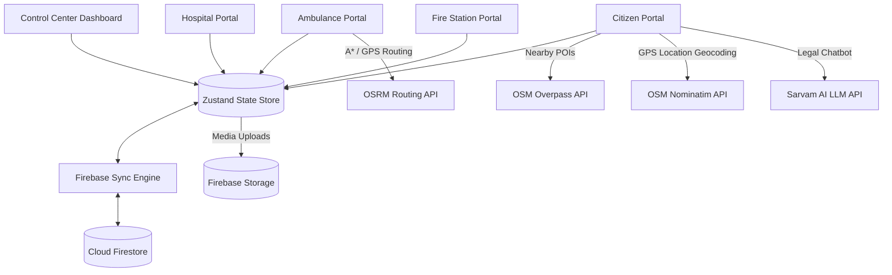

# NISERS (National Integrated Safety & Emergency Response System)
## System Architecture & Technical Documentation

NISERS is a web-based real-time emergency coordination dashboard tailored for the Kathmandu Valley. It serves as a unified channel linking citizens, emergency response agencies (Ambulances and Fire Stations), medical facilities (Hospitals), and the National Command Center. 

The system utilizes an **offline-first local state store** that automatically upgrades to a **real-time Firebase backend** if credentials are supplied. It includes a custom **A\* vehicle navigation routing algorithm**, OpenStreetMap API integration for nearby medical services, and a bilingual AI legal assistant ("Nepal Kanoon Sahayak").

---

## 1. System Architecture

The following diagram illustrates the relationship between the client portals, the centralized Zustand State Store, the Firebase Sync Engine, and external API integrations.



### Real-Time Synchronization Flow
1. **Local Writes First**: When a user updates state (e.g., accepts a mission or submits a request), the action updates the local Zustand store immediately to ensure zero UI delay.
2. **Background Database Sync**: The store triggers a background promise (`firebaseWrite`) that updates Cloud Firestore if connected. Network failures do not halt UI operation.
3. **Reactive Listeners**: The `useFirebaseSync` hook registers real-time `onSnapshot` subscriptions for active collections. Any update in Firestore (from other dispatchers/vehicles) fires a callback that updates the local Zustand store, ensuring all clients stay synchronized in real time.

---

## 2. Core Technology Stack

| Technology | Layer | Purpose / Implementation Details |
| :--- | :--- | :--- |
| **React 19** & **TypeScript** | Frontend Core | Component-based interactive UI with strong type checking. |
| **Vite 7** | Build System | High-performance developer server and builds. |
| **Tailwind CSS v4** | Styling | Modern, highly optimized styling with fluid transitions. |
| **Zustand 5** | State Management | Centralized state engine managing active sessions, requests, alerts, and live GPS positions. |
| **Firebase Firestore 12** | Database | Real-time NoSQL synchronization across active terminals. |
| **Firebase Storage 12** | Object Storage | Media file hosting for uploaded citizen photos/videos. |
| **React Leaflet 5** & **Leaflet 1.9** | Mapping Engine | Interactive map rendering using OpenStreetMap Voyager tiles. |
| **OSRM API** | Vehicle Navigation | Fetches real street routes for navigation. |
| **Overpass API** | Location Intelligence | Fetches real-time coordinates of nearby public facilities (Hospitals, Police, Pharmacies). |
| **Nominatim API** | Reverse Geocoding | Reverse-resolves latitude and longitude coordinates to city and county names in Nepal. |
| **Sarvam AI API** | Large Language Model | Powers the conversational bilingual legal assistant chatbot. |

---

## 3. Data Models & Interface Schemas


### 3.1. User Profile Models
Every user belongs to one of five roles: `'citizen' | 'ambulance' | 'fireStation' | 'hospital' | 'controlCenter'`.

```typescript
export type Role = 'citizen' | 'ambulance' | 'fireStation' | 'hospital' | 'controlCenter';

export interface Location {
  lat: number;
  lng: number;
  address?: string;
}

export interface User {
  id: string;
  role: Role;
  name: string;
  phone: string;
  password?: string;
  status: 'active' | 'pending' | 'rejected';
  createdAt: number;
}
```

* **Ambulance (ALS / BLS Units)**:
  ```typescript
  export interface Ambulance extends User {
    role: 'ambulance';
    driverName: string;
    licenseNumber: string;
    vehicleNumber: string;
    vehicleType: string;
    location?: Location;
    available: boolean;
  }
  ```
* **Fire Station Profile**:
  ```typescript
  export interface FireStation extends User {
    role: 'fireStation';
    stationName: string;
    location?: Location;
  }
  ```
* **Hospital Profile**:
  ```typescript
  export interface Hospital extends User {
    role: 'hospital';
    hospitalName: string;
    address: string;
    emergencyContact: string;
    hospitalType: string;
    location?: Location;
  }
  ```

### 3.2. Operational & Transactional Models

* **Ambulance Request**:
  Requires citizen coordinates, description, and the explicit choice of hospital target destination:
  ```typescript
  export type RequestStatus = 'Requested' | 'Accepted' | 'En Route' | 'Arrived' | 'Patient Picked' | 'Heading To Hospital' | 'Completed' | 'Fire Under Control' | 'Resolved';

  export interface AmbulanceRequest {
    id: string;
    citizenId: string;
    location: Location;
    description: string;
    landmark?: string;
    hospitalId: string; // Required target destination
    hospitalName?: string;
    assignedAmbulanceId?: string;
    status: RequestStatus;
    createdAt: number;
    updatedAt: number;
  }
  ```

* **Fire Request**:
  Requires structured building and vertical parameters (floors, fire position):
  ```typescript
  export interface FireRequest {
    id: string;
    citizenId: string;
    location: Location;
    fireType: string;
    floors: number;
    position: 'Top' | 'Middle' | 'Bottom';
    description: string;
    assignedStationId?: string;
    status: RequestStatus;
    createdAt: number;
    updatedAt: number;
  }
  ```

* **UAV (Medical Drone) Mission**:
  Requested by hospitals, approved and dispatched by the Control Center:
  ```typescript
  export interface UAVMission {
    id: string;
    hospitalId: string;
    pickupLocation: Location;
    destinationLocation: Location;
    description: string;
    status: 'Pending' | 'Approved' | 'In Flight' | 'Delivered' | 'Rejected';
    currentLocation?: Location;
    createdAt: number;
  }
  ```

* **Live Tracking Position Update**:
  Broadcaster updates for active drones, helicopters, or ground units:
  ```typescript
  export interface LiveLocation {
    entityId: string;
    entityType: 'ambulance' | 'fireVehicle' | 'uav' | 'vtol';
    location: Location;
    timestamp: number;
    speed?: number;
    altitude?: number;
  }
  ```

---

## 4. Key Engine Implementations

### 4.1. Navigation & A\* Routing Engine


The navigation system features a **Dual-Engine design**:
1. **Primary Route Solver**: Query the OpenStreetMap OSRM driving engine API to obtain true street path coordinates.
2. **Fallback Local A\* Solver**: If the client is offline or the OSRM server is unreachable, the system initializes a local grid-based A\* pathfinder.

#### Local A\* Math & Bounding Parameters:
* **Grid Bounds**: A dynamically calculated 60×60 cell matrix bounded between the start and end coordinates with a safety padding `PAD = 0.012` (~1.3 km) to permit detours.
* **Corridor Heuristics**: Simulates road cost structures in Kathmandu. It lowers moving costs (g-value weights) along simulated main axes (e.g., Ring Road, East-West artery) and uses Haversine distance heuristics ($h$) to guide search efficiency.
* **Douglas-Peucker Path Simplification**: Reduces nodes in the solved grid path using coordinate perpendicular distance checks ($d > \epsilon$) to output clean path segments:
  $$d = \frac{|(x_2 - x_1)(y_1 - y_0) - (x_1 - x_0)(y_2 - y_1)|}{\sqrt{(x_2 - x_1)^2 + (y_2 - y_1)^2}}$$

---

### 4.2. "Nepal Kanoon Sahayak" AI Law Assistant
This component provides legal guidance to citizens regarding Nepalese statutes. It features:
* **Bilingual Translation Rules**: Automatically responds in Nepali (Devanagari script) or English to match the user's inquiry, prioritizing Nepali for mixed code inputs.
* **Strict Statutory Alignment**: Structured context guides prompts specifically under the *Muluki Ain*, *Electronic Transactions Act (Cybercrime)*, *Narcotics Control Act*, and others.
* **Structured Output Constraint**:
  ```markdown
  **What is Illegal / के गैरकानुनी छ:** [Description]
  **Law / कानुन:** [Act + Section]
  **Punishment / सजाय:** [Fine in NPR and/or Jail terms]
  **Precaution / सावधानी:** [Practical safety tip]
  **Disclaimer / सूचना:** [Standard legal disclaimer]
  ```
* **Local Fallback Database**: If the API token is depleted, a keyword-matching regex engine scans a local knowledge base of common legal topics (cybercrime, domestic violence, drunk driving, etc.) to serve responses offline.

---

### 4.3. Unified Live Map Component

The live map is built on Leaflet and visualizes all operational variables:
* **Pulse Animations**: Custom CSS animation rules (`mapPulse` and `gmBreathe`) render active distress call locations with red ring pulses.
* **Layer Overlays**: Renders active ambulances, fire vehicles, drone flight vectors (magenta straight-line routes), and active public warnings.
* **Responsive Fullscreen Handler**: Leverages React portals and local state variables to break the map container out of layouts into a dedicated control interface for the dispatcher.

---

## 5. Portal & Dashboard Guide

### 5.1. Citizen Portal
* **Emergency Dispatch**: Submit Ambulance requests (requires choosing a destination hospital) and Fire requests (specifies building floor and ignition point height).
* **Nearby Services**: Requests the user's location via GPS, queries the OSM Overpass API for services within 5km, and calculates direct distance and directions.
* **Blood Bank Network**: Publish requests matching blood groups, and click to dial contact numbers for active matches.
* **Alert Center**: Submit reports on hazards (e.g., road blockages, flooding) for moderator approval.

### 5.2. Control Center Dashboard
* **Moderation Queue**: Approves or rejects new user accounts (Ambulances, Hospitals, Fire Stations) before they can go on-duty.
* **Alert Moderation**: Reviews submitted citizen hazards, pushing them to the public list upon verification.
* **Incident Dispatch Feed**: Visualizes all active medical and fire incidents, displaying status tracking steps in real-time.
* **Air/Drone Control**: Tracks and manages UAV delivery paths and VTOL helicopter assets.

### 5.3. Ambulance Portal
* **Mission Dispatch**: Sound alarms for new nearby medical incidents, displaying distance and ETA parameters.
* **Step-by-Step Navigation**: Leads the driver through standard operational stages:
  $$\text{Accepted} \rightarrow \text{En Route} \rightarrow \text{Arrived at Scene} \rightarrow \text{Patient Picked} \rightarrow \text{Heading to Hospital} \rightarrow \text{Completed}$$

### 5.4. Hospital Portal
* **Emergency Room Intake**: Real-time listing of incoming patients, display of patient condition types, ETAs, and assigned ambulance license numbers.
* **Blood Bank Coordinator**: Publishes community requests for blood units.
* **Drone Dispatcher**: Configures pickup and delivery coordinates, calculates distance and payload details, and sends flight requests for drone transport.

### 5.5. Fire Station Portal
* **Fire Incident Tracking**: Shows details of active fire calls, including building floor counts and height details.
* **Mission Updates**: Drives vehicle crews through dispatch statuses to keep the Control Center informed.

---

## 6. Setup & Deployment Instructions

### 6.1. Environment Variables Config (`.env`)
Create a `.env` file in the root directory. If this file is empty, the app runs in **Offline Mock Mode**, utilizing simulated entities:

```env
# Firebase API Credentials
VITE_FIREBASE_API_KEY="your_api_key"
VITE_FIREBASE_AUTH_DOMAIN="your_project_id.firebaseapp.com"
VITE_FIREBASE_PROJECT_ID="your_project_id"
VITE_FIREBASE_STORAGE_BUCKET="your_project_id.appspot.com"
VITE_FIREBASE_MESSAGING_SENDER_ID="your_sender_id"
VITE_FIREBASE_APP_ID="your_app_id"
VITE_FIREBASE_MEASUREMENT_ID="your_measurement_id"

# Chatbot AI Assistant API Config
VITE_SARVAM_API_KEY="your_sarvam_api_token"
```

### 6.2. Development Commands

```bash
# Install dependencies
npm install

# Start Vite dev server locally
npm run dev

# Build the project
npm run build

# Preview production build locally
npm run preview
```

### 6.3. Firestore Security Configuration


```javascript
rules_version = '2';
service cloud.firestore {
  match /databases/{database}/documents {
    match /users/{userId} {
      allow read, write: if true;
    }
    match /ambulanceRequests/{docId} {
      allow read, write: if true;
    }
    match /fireRequests/{docId} {
      allow read, write: if true;
    }
    match /complaints/{docId} {
      allow read, write: if true;
    }
    match /communityAlerts/{docId} {
      allow read, write: if true;
    }
    match /bloodRequests/{docId} {
      allow read, write: if true;
    }
    match /uavMissions/{docId} {
      allow read, write: if true;
    }
    match /liveLocations/{docId} {
      allow read, write: if true;
    }
  }
}
```
